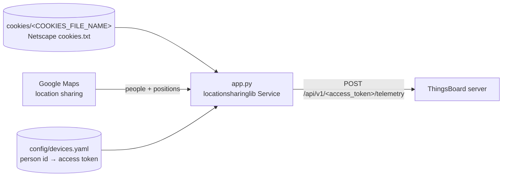

# ThingsBoard Location Sharing

`thingsboard-locationsharing` is a small Python service that reads the positions of people who
share their location with a Google account (Google Maps location sharing) and pushes them as
telemetry to matching devices on a [ThingsBoard](https://thingsboard.io/) server. It is meant for
self-hosters who already run ThingsBoard and want family or team members, who have agreed to it,
to show up on ThingsBoard maps and dashboards.

> [!IMPORTANT]
> This project tracks people's locations. Only track people who have explicitly consented. It
> relies on an unofficial, cookie-based scraping approach that is **not affiliated with or endorsed
> by Google**, may break at any time, and may violate Google's Terms of Service. See
> [Privacy and consent](#privacy-and-consent).

## Table of contents

- [Features](#features)
- [How it works](#how-it-works)
- [Requirements](#requirements)
- [Getting the Google cookies](#getting-the-google-cookies)
- [ThingsBoard device setup](#thingsboard-device-setup)
- [Installation](#installation)
- [Configuration](#configuration)
- [Telemetry sent to ThingsBoard](#telemetry-sent-to-thingsboard)
- [Troubleshooting](#troubleshooting)
- [Privacy and consent](#privacy-and-consent)
- [Security notes](#security-notes)
- [Development](#development)
- [Contributing](#contributing)
- [License](#license)

## Features

- Reads everyone who shares their location with a Google account, using
  [`locationsharinglib`](https://pypi.org/project/locationsharinglib/) and a browser cookies file.
- Maps each Google person ID to a ThingsBoard device through a simple `devices.yaml` file; people
  without a matching entry are ignored.
- Sends latitude, longitude, GPS accuracy and battery level to ThingsBoard over the
  [HTTP device API](https://thingsboard.io/docs/reference/http-api/) using each device's access
  token.
- Polls on a configurable interval (in minutes).
- Runs as a Docker container (Dockerfile included) or directly with Python.

## How it works



1. On start, `cookieshandler.py` parses the cookies file and makes one request to
   `https://maps.google.com` with those cookies.
2. `app.py` creates a `locationsharinglib.Service` from the cookies file and the Google account
   email (`EMAIL_ADDRESS`).
3. `config/devices.yaml` is loaded. If it doesn't exist, the bundled `devices.yaml` template is
   copied there first.
4. Every `UPDATE_INTERVAL` minutes, the service calls `get_all_people()`. For each person whose ID
   matches a device `id` in `devices.yaml`, it posts a telemetry message to ThingsBoard with that
   device's access token.
5. Every 32 minutes, the cookies file is parsed again, but the result is discarded and the
   `Service` is not rebuilt, so this has no effect. After replacing the cookies file, restart the
   service.

The first poll happens after one full interval, not at startup.

## Requirements

- A Google account that other people share their location with (Google Maps → Location sharing).
- A cookies file exported from a browser session logged in to that account (see below).
- A ThingsBoard server (Community, Professional or Cloud) reachable over HTTP(S), with one device
  per tracked person.
- Docker, or Python 3 with `pip` and `venv` to run from source. The Docker image is based on
  `ubuntu:24.10`, which currently prevents it from building (see [Installation](#installation)).

## Getting the Google cookies

The service expects a **Netscape / Mozilla `cookies.txt` file**: one cookie per line,
tab-separated, with the cookie name in the 6th column and its value in the 7th. Lines starting with
`#` are ignored. This is the format written by most "export cookies.txt" browser extensions.

General steps:

1. In a browser, sign in to the Google account that receives the location shares and open
   [Google Maps](https://maps.google.com).
2. Export the cookies for the `google.com` domain in `cookies.txt` (Netscape) format with a
   cookie-export extension you trust.
3. Save the file in the directory you will mount as `/app/cookies` (for example
   `./cookies/google_cookies.txt`) and set `COOKIES_FILE_NAME` to the file name only
   (`google_cookies.txt`).

The file is equivalent to being signed in to the account. Treat it like a password, and export a
new one when Google invalidates the session (see [Troubleshooting](#troubleshooting)).

The file must include Google's secure session cookie (`__Secure-1PSID` or `__Secure-3PSID`), which
is present when you export from a signed-in session. Without it, `locationsharinglib` (5.0.3, the
version installed from the unpinned `requirements.txt`) rejects the file as invalid cookies.

## ThingsBoard device setup

For each person you want to track:

1. In ThingsBoard, go to **Entities → Devices** and add a device (for example, `Alice's phone`).
2. Open the device, choose **Copy access token** (Manage credentials → Access token), and keep it
   for `devices.yaml`.
3. Find the person's Google ID as reported by `locationsharinglib` (`Person.id`). `app/app.py`
   contains a commented-out debug line in `run()` that logs each person's nickname and ID.
   <!-- TODO: verify the recommended way to look up a person's Google ID -->
4. Add an entry to `devices.yaml` (see [devices.yaml](#devicesyaml)).
5. To show people on a map, add a map widget to a dashboard and use the `latitude` and
   `longitude` telemetry keys.

## Installation

No image of this project is currently published: the `techblog/thingsboard-locationsharing`
repository on Docker Hub has no tags, there is no public GHCR package, and there are no GitHub
releases or git tags. Build the image locally.

> [!WARNING]
> The committed `Dockerfile` can't currently be built. Its base image, `ubuntu:24.10`, is
> end-of-life, so `apt update` fails ("does not have a Release file"). Past that,
> `pip3 install --upgrade pip` fails with `externally-managed-environment` (PEP 668). The Docker
> instructions below describe the intended path and will work once the Dockerfile is fixed. Until
> then, run [from source](#from-source).

> [!NOTE]
> The committed `docker-compose.yaml` refers to `techblog/locationsharing` and to `MQTT_*`
> variables. That image belongs to a different project, and this service does not use MQTT. Use
> the example below instead.

### Docker Compose

Build the image and create the directories:

```bash
git clone https://github.com/t0mer/thingsboard-locationsharing.git
cd thingsboard-locationsharing
docker build -t thingsboard-locationsharing .
mkdir -p data/cookies data/config
cp /path/to/google_cookies.txt data/cookies/
cp app/devices.yaml data/config/devices.yaml   # then edit it
```

`docker-compose.yaml`:

```yaml
services:
  locationsharing:
    image: thingsboard-locationsharing
    container_name: thingsboard-locationsharing
    restart: always
    environment:
      - EMAIL_ADDRESS=you@example.com                    # Google account that receives the shares
      - COOKIES_FILE_NAME=google_cookies.txt             # file name only, inside /app/cookies
      - TB_SERVER_ADDRESS=https://thingsboard.example.com  # scheme + host[:port], no trailing slash
      - UPDATE_INTERVAL=1                                # minutes
    volumes:
      - ./data/cookies:/app/cookies
      - ./data/config:/app/config
```

```bash
docker compose up -d
docker compose logs -f
```

### docker run

```bash
docker run -d --name thingsboard-locationsharing --restart always \
  -e EMAIL_ADDRESS=you@example.com \
  -e COOKIES_FILE_NAME=google_cookies.txt \
  -e TB_SERVER_ADDRESS=https://thingsboard.example.com \
  -e UPDATE_INTERVAL=1 \
  -v "$PWD/data/cookies:/app/cookies" \
  -v "$PWD/data/config:/app/config" \
  thingsboard-locationsharing
```

Mount `/app/config` as well as `/app/cookies`. The image only creates `/app/cookies`, and the
service reads `config/devices.yaml` relative to `/app`.

### From source

The service uses paths relative to the working directory (`./cookies/`, `config/devices.yaml` and
the `devices.yaml` template), so run it from inside `app/`. Use a virtual environment: recent
Debian and Ubuntu releases block system-wide `pip install` (PEP 668). `requirements.txt` doesn't
list PyYAML, which `app.py` imports, so install it too:

```bash
git clone https://github.com/t0mer/thingsboard-locationsharing.git
cd thingsboard-locationsharing
python3 -m venv .venv && . .venv/bin/activate
pip install -r requirements.txt pyyaml
cd app
mkdir -p cookies config
cp /path/to/google_cookies.txt cookies/
export EMAIL_ADDRESS=you@example.com
export COOKIES_FILE_NAME=google_cookies.txt
export TB_SERVER_ADDRESS=https://thingsboard.example.com
export UPDATE_INTERVAL=1
python app.py
```

## Configuration

### Environment variables

All settings come from environment variables. There are no CLI flags.

| Variable | Default (Docker image) | Required | Description |
|---|---|---|---|
| `EMAIL_ADDRESS` | empty | Yes | Email of the Google account that receives the location shares (`authenticating_account` for `locationsharinglib`). |
| `COOKIES_FILE_NAME` | empty | Yes | Name of the cookies file inside `./cookies/` (`/app/cookies` in the container). File name only, no path. |
| `TB_SERVER_ADDRESS` | empty | Yes | Base URL of the ThingsBoard server, such as `https://thingsboard.example.com`. The service appends `/api/v1/<access_token>/telemetry`. |
| `UPDATE_INTERVAL` | `1` | Yes | Polling interval in whole minutes. |

The defaults come from the `Dockerfile`. When running from source, none of them has a default:
the service fails to start if `COOKIES_FILE_NAME` or `UPDATE_INTERVAL` is unset.

Fixed values (not configurable): the devices file is `config/devices.yaml`, and the cookies file is
re-parsed every 32 minutes (with no effect, see [How it works](#how-it-works)).

### devices.yaml

`config/devices.yaml` (`/app/config/devices.yaml` in the container) maps Google people to
ThingsBoard devices. On first start, if the file is missing, the template from `app/devices.yaml`
is copied there.

| Key | Description |
|---|---|
| `devices` | List of tracked people. |
| `devices[].name` | Free-text label for the entry. Not sent to ThingsBoard. |
| `devices[].id` | The person's Google ID, compared with `Person.id` from `locationsharinglib`. |
| `devices[].access_token` | Access token of the ThingsBoard device that receives this person's telemetry. |

Example (placeholders):

```yaml
devices:
  - name: Alice
    id: "<google-person-id>"
    access_token: "<thingsboard-device-access-token>"
  - name: Bob
    id: "<google-person-id>"
    access_token: "<thingsboard-device-access-token>"
```

Quote the `id` so YAML keeps long numeric IDs as strings. The file is only read at startup; restart
the service after editing it.

## Telemetry sent to ThingsBoard

For each matched person, on every poll:

```http
POST <TB_SERVER_ADDRESS>/api/v1/<access_token>/telemetry
Content-Type: application/json
```

```json
{
  "latitude": 32.0853,
  "longitude": 34.7818,
  "gps_accuracy": 15,
  "battery_level": 87
}
```

| Key | Source (`locationsharinglib` `Person`) | Meaning |
|---|---|---|
| `latitude` | `latitude` | Latitude in decimal degrees. |
| `longitude` | `longitude` | Longitude in decimal degrees. |
| `gps_accuracy` | `accuracy` | Reported accuracy radius (meters). |
| `battery_level` | `battery_level` | Phone battery level as reported by Google (may be empty). |

No timestamp is sent, so ThingsBoard stores each value with the time it was received. Nothing is
written as attributes.

## Troubleshooting

- **`The cookie file provided does not provide a valid session`**: the cookies are expired or
  incomplete. Export a fresh `cookies.txt` from a browser that is signed in to the account and
  restart. After this error the process keeps running until the first poll, which then fails
  with a `NameError` and stops the process (with `restart: always`, Docker restarts it).
- **`IsADirectoryError: './cookies/'` at startup (container)**: `COOKIES_FILE_NAME` is empty (the
  image default). Set it to the cookies file name.
- **`TypeError` at startup (from source)**: `COOKIES_FILE_NAME` is not set. From source, an unset
  `UPDATE_INTERVAL` also raises a `TypeError`.
- **`ValueError` at startup**: `UPDATE_INTERVAL` is empty or not a whole number.
- **`ModuleNotFoundError: No module named 'yaml'`**: install PyYAML (`pip install pyyaml`); it
  isn't listed in `requirements.txt`.
- **Crash at startup with `InvalidCookieFile` or `InvalidData`**: raised by `locationsharinglib`
  when the cookies file can't be read or Google returns unexpected data. Only `InvalidCookies` is
  handled, so these stop the process. Check the file format and export fresh cookies.
- **Cookies replaced but nothing changed**: the service only uses the cookies it loaded at startup.
  Restart it after replacing the file.
- **`No such file or directory` for the cookies file**: the file isn't in the mounted
  `/app/cookies` directory, or `COOKIES_FILE_NAME` contains a path instead of just the file name.
- **`Loading devices list` followed by a file error**: `/app/config` doesn't exist. Mount a
  directory at `/app/config` (the image doesn't create it).
- **No telemetry for a person**: their Google ID doesn't match any `id` in `devices.yaml`, or they
  stopped sharing their location with the account. Only people with a matching entry are sent.
- **`Failed to send data: ...`**: ThingsBoard rejected or didn't receive the request. Check that
  `TB_SERVER_ADDRESS` includes the scheme (`http://` or `https://`) and has no trailing slash, and
  that the access token is correct.
- **The process exits during a poll**: errors while fetching locations from Google (network
  errors, changes on Google's side) are not caught and stop the process. Check the logs and rely on
  the container restart policy.
- **Nothing happens right after start**: the first poll runs after one `UPDATE_INTERVAL`.

## Privacy and consent

- **Consent first.** Only track people who know about it and have agreed to it, and stop when they
  ask. Location data is personal data and may be regulated where you live (for example under the
  GDPR).
- **Unofficial method.** This project scrapes Google Maps location sharing with session cookies
  through the third-party `locationsharinglib`. It is not affiliated with, endorsed by or supported
  by Google. It can stop working whenever Google changes its site, and automated access may violate
  Google's Terms of Service. Your account could be challenged or restricted.
- **Where the data goes.** Positions are stored in your ThingsBoard instance. Restrict who can see
  the devices and dashboards, and set a retention policy that fits the people being tracked.

## Security notes

- The cookies file gives full access to the Google account. Keep it out of git and images, limit
  file permissions, mount it read-only where possible, and revoke the session (sign out of that
  browser session in your Google account) if it leaks.
- Device access tokens let anyone write telemetry to the device. Keep `devices.yaml` private.
- Use `https://` for `TB_SERVER_ADDRESS` whenever ThingsBoard is not on a trusted local network.
- Consider a dedicated Google account that only receives location shares, instead of a personal one.

## Development

Project layout:

```text
app/
  app.py            # main loop: loads devices, polls Google, posts telemetry
  cookieshandler.py # parses the Netscape cookies.txt file
  device.py         # Device model (name, id, access_token)
  devices.yaml      # template copied to config/devices.yaml on first run
Dockerfile          # ubuntu:24.10 + python3-pip, entrypoint python3 /app/app.py
docker-compose.yaml
requirements.txt    # loguru, schedule, paho-mqtt, locationsharinglib, requests, urllib3
                    # (PyYAML is imported by app.py but missing here)
VERSION             # image version used by the Docker Hub workflow
```

There are no tests or linters configured.

### Workflows

| Workflow | Trigger | Publishes | Platforms |
|---|---|---|---|
| `.github/workflows/docker-image.yml` ("Docker Build") | Manual, or after a workflow named "Create Release" completes (no such workflow exists in this repo) | `techblog/thingsboard-locationsharing:latest` and `:<VERSION>` on Docker Hub | `linux/amd64`, `linux/arm64` |
| `.github/workflows/publish-ghcr.yml` ("Publish to GHCR") | Manual, with an optional `tag` input (default `latest`) | `ghcr.io/t0mer/thingsboard-locationsharing:<tag>` and `:latest` | `linux/amd64`, `linux/arm64`, `linux/arm/v7` |

The Docker Hub workflow needs the `DOCKERHUB_USERNAME` and `DOCKERHUB_TOKEN` repository secrets; the
GHCR workflow uses `GITHUB_TOKEN`. As noted in [Installation](#installation), neither registry
currently has a published image.

## Contributing

Issues and pull requests are welcome. Please keep changes focused, describe how you tested them
(ideally with a test ThingsBoard device), and never include real cookies, tokens, Google IDs or
coordinates in issues, commits or logs.

## License

Licensed under the [Apache License 2.0](LICENSE).
